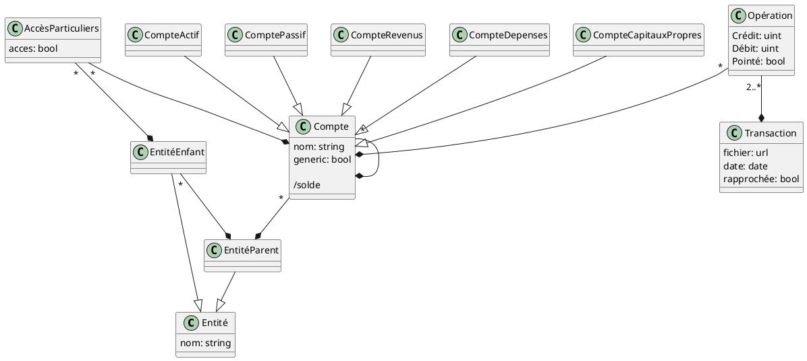

## Plantuml BDD flairsou

Accès :

Accès « Communs »
Ex: tous enfants de PVDC ont accès à PVDC:Dépenses:Fournisseurs

Accès « Particuliers »
Ex : l'enfant PVDC:Pic a accès à PVDC:Actifs:Pic (compte en banque)

Récupérer comptes Accès génériques + Accès persos